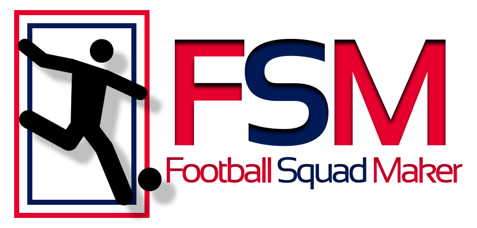
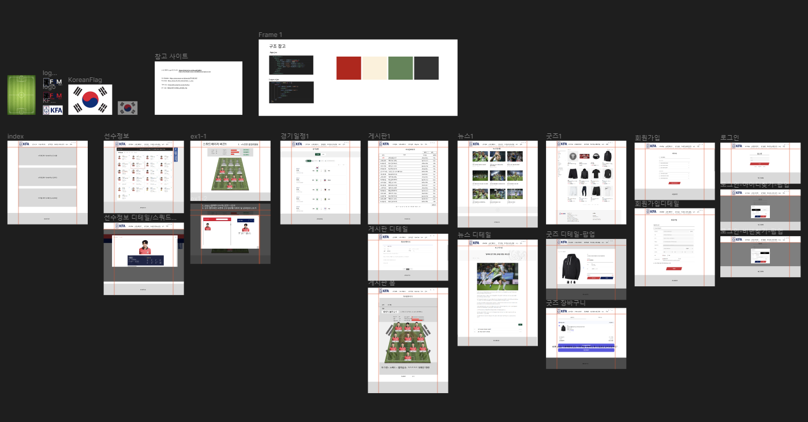
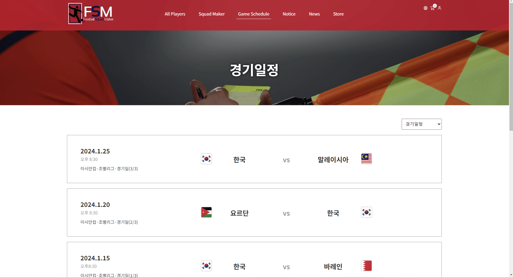
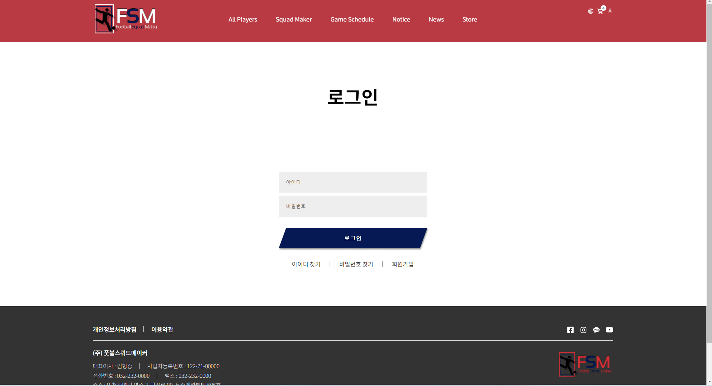

# 풋볼스쿼드메이커 홈페이지 제작 (팀작업)

## 팀원

|      | 이름   | Github                                     | 작업사항                                                                                                                                                                                                                                                                                                                                                                        |
| :--- | :----- | :----------------------------------------- | :------------------------------------------------------------------------------------------------------------------------------------------------------------------------------------------------------------------------------------------------------------------------------------------------------------------------------------------------------------------------------ |
| FE   | 김하진 | [@HajinKimm](https://github.com/HajinKimm) | [메인](https://hajinkimm.github.io/TP_FSM/dist/) [경기일정](https://hajinkimm.github.io/TP_FSM/dist/#/game_schedule) [게시판](https://hajinkimm.github.io/TP_FSM/dist/#/notice) [뉴스](https://hajinkimm.github.io/TP_FSM/dist/#/news) [로그인](https://hajinkimm.github.io/TP_FSM/dist/#/login)/[회원가입](https://hajinkimm.github.io/TP_FSM/dist/#/join) |
| FE   | 김형종 | [@Ocjji](https://github.com/Ocjji)         | [스쿼드메이커](https://hajinkimm.github.io/TP_FSM/dist/#/squad) [굿즈](https://hajinkimm.github.io/TP_FSM/dist/#/store) [게시판 작성](https://hajinkimm.github.io/TP_FSM/dist/#/notice/writing/squad)                                                                                                                                                                 |
| FE   | 이명관 | [@audrhks29](https://github.com/audrhks29) | [선수명단](https://hajinkimm.github.io/TP_FSM/dist/#/playerInfo) [선수명단추가](https://hajinkimm.github.io/TP_FSM/dist/#/addPlayer) [장바구니](https://hajinkimm.github.io/TP_FSM/dist/#/cart)                                                                                                                                                                       |

# 프로젝트 사이트

[사이트 바로가기](https://hajinkimm.github.io/TP_FSM/dist/)

 
 

# 프로젝트 참고 사이트

1. [대한축구협회](https://www.kfa.or.kr)
2. [FC ONLINE](https://fconline.nexon.com/datacenter/squadmaker)

# 프로젝트 기술 스택

    

## 프로젝트 작업 순서
1. 프로젝트 컨셉 회의 및 선정
2. 참고 페이지 선정
3. 페이지 리뉴얼 회의
4. 와이어프레임 제작
5. 디자인 적용
6. 페이지 분담 및 프레임워크, 라이브러리 선정
7. 페이지 분담에 따른 프로젝트 제작

## Wireframe

[Figma Link](https://www.figma.com/file/lipd6EeDegBbtLATWUcWjm/Player-Squad?type=design&node-id=0-1&mode=design) 

# 프로젝트 기능 구현

### 1) 메인

* scroll 이동 시 header-fixed
* news 컨텐츠 최신 뉴스로 자동 변경
* 장바구니 수량 출력

### 2) 선수명단 / 선수명단 추가

* search box 구현
* 선수포지션 type 클릭 시 해당 내용 출력
* content 클릭 시 Popup창 열림
* 선수 추가 버튼 클릭시 페이지 이동
* 원하는 정보의 선수 추가 기능 구현
* 선수 정보 변경 및 삭제 기능 구현

### 3) 스쿼드메이커

* Squad 이미지 클릭 시 Popup창 열림
* 포지션에 맞는 content 출력
* 선수정보 확인 및 선수 선택 기능 구현
* 선택된 content 관련 내용 수치화 출력
* 제작한 Squad Maker 게시글 작성 기능 구현
* 게시글 작성 버튼 클릭시 페이지 이동

### 5) 경기일정

* 경기일정 년도에 따른 content 내용 변경
* page 번호 구현

### 6) 게시판

* search box 구현
* 글쓰기 시 '분류-자유게시판'의 글만 작성 구현
* 게시글 작성 시 현재날짜 자동 출력
* 게시글 확인시 조회수 변경

### 7) 뉴스

* search box 구현
* content 더보기 버튼 구현
* content 클릭시 상세 페이지로 이동
* 상세페이지 이전글, 다음글, 목록 버튼 구현

### 8) 굿즈 / 장바구니

* 상품 type 클릭 시 해당 내용 출력
* content 클릭 시 Popup창 열림
* 상품에 따라 다른 옵션선택 구현
* page 번호 구현
* 장바구니 목록에 따른 주문금액 변경

### 8) 로그인 / 회원가입

* 약관보기 아코디언 메뉴 구현
* 체크박스 전체동의 구현
